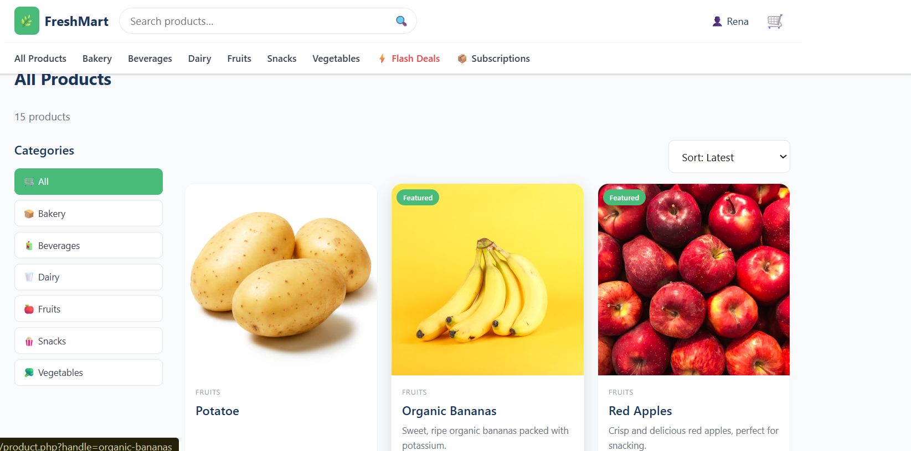

# 🌿 FreshMart — Online Grocery Store

A full-featured e-commerce web application built with **PHP 8.2**, **MySQL**, and **Docker**.  
FreshMart lets customers browse fresh groceries, manage a cart, and pay via **MTN / Airtel Mobile Money** (Paypack).

---

## 🚀 Live Deployment

> **URL:** https://freshmartstore.gt.tc/

> **GitHub:** https://github.com/Archie-ctr/freshmart

---

## 📸 Screenshots

### Homepage


### Shop / Product Listing


### Product Detail


### Shopping Cart


### Checkout


### Payment Processing


### Order Confirmation


### Login


### Forgot Password


### Admin Dashboard


### Admin Analytics


### Admin Products


### Admin Orders


### Admin Flash Deals


### Admin Vendor Management


### Admin Settings


---

## 📋 Features

| Area | Features |
|---|---|
| **UI** | Responsive design, mobile-friendly, hero banner, navigation, footer |
| **Products** | Listing, detail page, categories/collections, search, sort, ratings |
| **Cart** | Add/remove items, update quantities, real-time totals (USD + RWF) |
| **Checkout** | Customer details form, order summary, Mobile Money payment (USSD push) |
| **Orders** | Order confirmation page, "My Orders" history |
| **Admin** | Dashboard, product CRUD, collections, order management, analytics, vendor, settings |
| **Auth** | Register, login, logout, OTP 2FA, forgot password, role-based access |
| **Payment** | Paypack integration — MTN MoMo (078/079) & Airtel Money (072/073/075) |
| **Advanced** | Loyalty points, referrals, flash deals, subscriptions, wishlist, AI recommendations |

---

## 🛠 Technologies Used

- **Backend:** PHP 8.2 (no framework)
- **Database:** MySQL 8.0
- **Frontend:** Vanilla HTML/CSS/JS (no framework)
- **Payment:** Paypack (Rwanda Mobile Money)
- **Email:** Gmail SMTP via raw PHP socket
- **Container:** Docker + Docker Compose
- **CI/CD:** GitHub Actions
- **Web Server:** Apache (inside Docker)
- **Hosting:** InfinityFree

---

## 🐳 Docker Setup (Local Development)

### Prerequisites
- [Docker Desktop](https://www.docker.com/products/docker-desktop/)

### Run with Docker Compose

```bash
# 1. Clone the repository
git clone https://github.com/Archie-ctr/freshmart.git
cd freshmart

# 2. Start all services (app + MySQL + phpMyAdmin)
docker compose up -d

# 3. Open the app
open http://localhost:8080/store-php/
```

| Service | URL |
|---|---|
| App | http://localhost:8080/store-php/ |
| phpMyAdmin | http://localhost:8081 (dev profile only) |

```bash
# Start with phpMyAdmin
docker compose --profile dev up -d

# Stop & clean up
docker compose down -v
```

---

## ⚙️ CI/CD Pipeline (GitHub Actions)

```
Push to main
    │
    ├─► Job 1: PHP Lint
    │       └── php -l on all .php files
    │
    ├─► Job 2: Docker Build & Smoke Test
    │       ├── docker build
    │       ├── docker compose up
    │       └── curl health check (HTTP 200)
    │
    └─► Job 3: Deploy to InfinityFree via FTP
            └── SamKirkland/FTP-Deploy-Action@v4.3.5
```

### Required GitHub Secrets

| Secret | Description |
|---|---|
| `FTP_PASSWORD` | InfinityFree FTP account password |

---

## 🗄️ Database

Schema and seed data are in **`install.sql`** (23 tables, 14 products, 6 categories, 3 subscription boxes).

```bash
mysql -u root freshmart < install.sql
```

---

## 🔐 Admin Access

| Email | Password |
|---|---|
| admin@freshmart.com | admin123 |

---

## 📁 Project Structure

```
store-php/
├── .github/workflows/ci-cd.yml   # CI/CD pipeline
├── ajax/                          # AJAX endpoint handlers
├── assets/                        # CSS & JS
├── docker/                        # Docker config
├── screenshots/                   # Application screenshots
├── uploads/products/              # Uploaded product images
├── admin.php                      # Admin dashboard
├── cart.php                       # Shopping cart
├── checkout.php                   # Checkout + payment
├── flash-deals.php                # Flash deals page
├── forgot-password.php            # Password reset
├── functions.php                  # Helpers (auth, cart, price, CSRF, OTP, loyalty...)
├── index.php                      # Homepage
├── install.sql                    # Database schema + seed data
├── layout.php                     # Shared header/footer
├── login.php / register.php       # Authentication
├── mailer.php                     # Raw-socket SMTP mailer
├── order-confirmation.php         # Post-payment confirmation
├── orders.php                     # My orders history
├── paypack.php                    # Paypack API integration
├── product.php                    # Product detail + reviews
├── referral.php                   # Referral program
├── reset-password.php             # OTP password reset
├── shop.php                       # Product listing + search
├── subscriptions.php              # Subscription boxes
├── vendor.php                     # Vendor marketplace
└── wishlist.php                   # Wishlist
```

---

## 📄 License

MIT — free to use for educational purposes.
